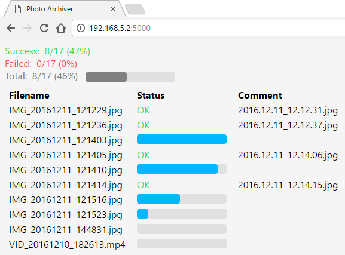

# Overview

**PhotoArchiver** organizes and archives your photos and videos on the storage machine where it runs, at home or anywhere in the cloud.

A web interface allows you to easily transfer your files with a simple drag and drop of your files to your web browser window.

Photos and videos are organized based on the date they were taken. Date taken is extracted from various file metadata. (e.g. EXIF)



## How to use

### Build, deploy and run

#### Linux

In order to build and run **PhotoArchiver**, you need .NET Core to be installed on the hosting machine. (SDK 3.1 or higher)

After you cloned this repository, go to the `Linux` directory and run:

```sh
./0-setup-service.sh [<user>]
```

The `<user>` is optional, if not provided, the current user is used. This determines the ownership of the running process in the service.

This step is a one-time step and does not need to be done again in the future, unless you change the user.

Then stop the service if it is running:
```sh
./1-stop-service.sh
```

Then build the source code and deploy:
```sh
./2-build.sh [<user>]
```

This will build **PhotoArchiver** in `Release` configuration and output everything to `/opt/PhotoArchiver`. Again, the `<user>` is optional and sets ownership of the folder `/opt/PhotoArchiver` and all its content. If `<user>` is not provided, the current user is used.

At this stage, you may want to update the configuration in `/opt/PhotoArchiver/appsettings.*` files.

See **Configuration** section below for more details.

Finally, starts the service:
```sh
./3-start-service.sh
```

Steps to stop the service, build the code and start the service can be done with one script if you do not need to change the configuration, with the following script:
```sh
./0-rebuild.sh
```

You can optionally enable the service so it will be started when the machine starts, as follow:
```sh
sudo systemctl enable PhotoArchiver
```

Also, you may need to set port to `firewalld` if you use it:
```sh
sudo firewall-cmd --add-port 5000/tcp --permanent
```

### Configuration

In the output directory, there should be a files named `appsettings.json` and `appsettings.Production.json` that contains the **PhotoArchiver** runtime configuration, as follow:

```
{
    "AppSettings": {
        "AllowedExtensions": [
            "png",
            "jpg",
            ...
        ]
    }
}
```

In the `AppSettings` section, you must add the following properties:

```
"TempAbsolutePath": "/path/to/temp/directory",
```

This is a temporary directory required for **PhotoArchiver** to store transferred files for processing before moving them to there final storage location.

```
"TargetAbsolutePath": "/path/to/files/storage"
```

This is the root directory where organized photos and videos are eventually stored.

### Listening end point

By default **PhotoArchiver** listens on all the network interface on port 5000.
If you want to change it, modify the code, in file `Program.cs` at line 28, where it looks like `.UseUrls("http://*:5000")`.
Change the number `5000` by whatever you want. Note that you have to do this before *publish*ing.

Sorry for those unfamiliar with technical details.

## For developers

### Interface

The project `PhotoArchiver.Contracts` provide the `IDateTakenExtractor` interface, which is defined as follow:

```cs
public interface IDateTakenExtractor
{
    bool ExtractDateTaken(Stream stream, out DateTime dateTaken);
}
```

Any class inheriting from the `IDateTakenExtractor` interface can participate in extending the supported file formats.

The classes implementing `IDateTakenExtractor` have to be registered in the `RootDateTakenExtractor` class (which is itself an `IDateTakenExtractor`) of the `PhotoArchiver` project.

### Implementations

For the moment there are 4 metadata formats supported: EXIF, RIFF, QuickTime and file name.

Their implementations are all in the `PhotoArchiver.DateTakenExtractors` project.

The class `LastModificationDateTakenExtractor` is not registered but is provided as legacy code and free for you to use at your own discretion.
